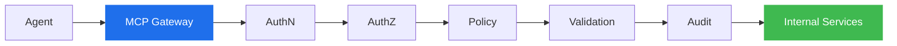
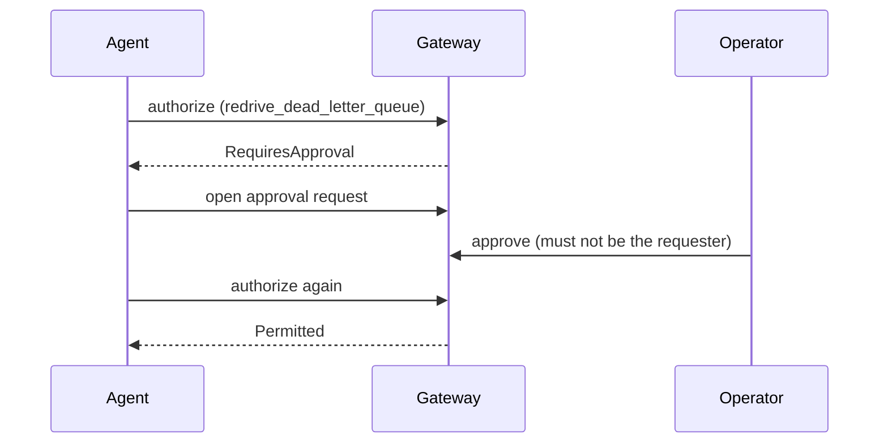

# A Gateway for AI Agents That Trusts Nothing

Most of the demos you see for AI agents skip the part that would get you fired. An agent reads a ticket, decides a queue needs draining, and calls `purge_queue` on production. In a slide it looks clever. In a real company it is a resume-generating event.

The uncomfortable truth is that an agent is just a program that was talked into doing something. If it can reach an internal service directly, then a well-phrased prompt, a poisoned document, or a plain hallucination is enough to trigger a real action. So I built [MCP Gateway](https://github.com/hazeliscoding/mcp-gateway): a layer that sits between agents and everything they might touch, and treats every tool call as guilty until proven allowed.

## The one rule

Agents never talk to internal services directly. Every call goes through the gateway, and the gateway runs the same checks every time, in the same order, with no exceptions for tools that "seem safe."

The important word there is *deterministic*. The model does not get to weigh in on whether it is authorized. It never sees the rules, never votes on the outcome, and cannot widen its own permissions by asking nicely. Authorization is plain application code that takes attributes in and returns a verdict out. That is the whole point: the interesting, probabilistic, occasionally-wrong part of the system is kept well away from the part that decides whether a destructive action runs.

## Tools are infrastructure, not free-for-alls

Before an agent can call anything, the tool has to be registered. A tool has a name, a set of versions, a description, the scopes it requires, and a risk level. Registration is an operator action, not something an agent can do to itself.

That last column, the toggle, is a kill switch. If a tool starts misbehaving you flip it off and every call to it is denied at the front door, no deploy required. Versions matter too. A deprecated version stops resolving, and "give me the latest" only ever returns an active one, so an agent cannot quietly downgrade to an older, weaker version of a tool to dodge a newer check.

## Risk decides the outcome

Every tool carries a risk class, and the risk class is what turns a yes/no permission check into something more useful. The policy engine runs the access rules first (is the tool switched on, is the version valid, does the caller actually hold every required scope), and only then looks at risk.

| Risk | What happens |
|------|--------------|
| ReadOnly / Write | Runs automatically once the caller holds the scopes |
| Privileged | Requires human approval before it can run |
| Destructive | Prohibited outright |

Ordering is deliberate. A caller who is missing a scope gets `Denied` and is never invited to seek approval for something they could not run anyway. And `Destructive` being a flat "no" rather than "ask nicely" is a choice: a categorical block is the safe default, and I would rather add a multi-party workflow later than ship a foot-gun now.

One detail I am quietly proud of: a deny is not an error. Asking the gateway "am I allowed to do this" always succeeds. The answer just happens to be no. So `Denied`, `RequiresApproval`, and `Prohibited` all come back as a normal `200` with an `outcome` field. A refused *action* and a refused *question* are different things, and collapsing them into one HTTP status is how audit trails end up lying to you.

## Four eyes on anything privileged

`RequiresApproval` would be useless if it were just a label, so there is a real workflow behind it. An agent opens an approval request. A **different** human approves it. Then the original agent asks again and is finally permitted.

The "different human" part is enforced, not suggested. An approver can never be the requester, which is the whole idea behind four-eyes: the person asking for the risky thing is not the person who signs off on it. The approval is also bound to the exact `(requester, tool, version)` it was granted for, so one agent cannot ride another agent's approval, and an approval for version 1.0 does not silently cover 2.0.

## If it happened, it is written down

Every authorization decision and every approval event lands in an append-only audit trail. Not just the permits. The denials, the blocked privileged attempts, the missing-scope rejections, all of it. Each entry records who acted, which tool and version, the result, and a trace id that ties it back to the request that caused it.

Sensitive values do not get stored raw. The context of a request is captured as a SHA-256 hash, so you can prove that two requests were identical, or that a specific resource was targeted, without leaving an ARN or a secret sitting in a log for the next person to find. Secrets get the same treatment at rest: a client secret is shown exactly once when it is issued, and only a PBKDF2 hash is kept. If someone dumps the database, they get hashes, not credentials.

## Proving the defenses actually hold

Security controls have a bad habit of quietly rotting. Someone refactors the authorization service, a check moves, and six months later the thing you were sure was locked down is wide open. Writing it down in a threat model does not stop that.

So the threat model is executable. Each attack (privilege escalation, token forgery, version downgrade, tool spoofing, riding someone else's grant, parameter injection, secret leakage) has a red-team test that tries to break the defense. If a defense regresses, the attack test goes green, and a green attack test fails the build. The rules and the proof that the rules work live in the same place, and they run on every commit.

## What the model actually controls

It is worth being blunt about the division of labor, because it is the part that makes this safe to run:

- The **model** decides *what it wants to do*. It proposes a tool call.
- The **gateway** decides *whether that is allowed*, using deterministic rules the model never touches.
- A **human** decides anything privileged, and cannot be the same human who asked.

The agent is a proposer. The gateway is the referee. The audit trail is the record. None of those roles are negotiable at runtime, and the interesting failure modes of language models (confident nonsense, prompt injection, being too helpful) all bounce off the deterministic wall instead of reaching production.

There is still work ahead. The gateway authorizes tool calls today but does not yet execute them, and the moment it starts proxying real invocations, a new class of problems shows up: tool output is untrusted input, and prompt injection hiding inside a tool's response has to be treated as data and never as instructions. That layer, and its own set of attack tests, is the next thing to build. The threat model already has those written down as open items rather than pretending they are solved.

If you want to poke at it, the whole thing runs with one command and seeds itself, admin console included. The code and the demo guide are [on GitHub](https://github.com/hazeliscoding/mcp-gateway).
